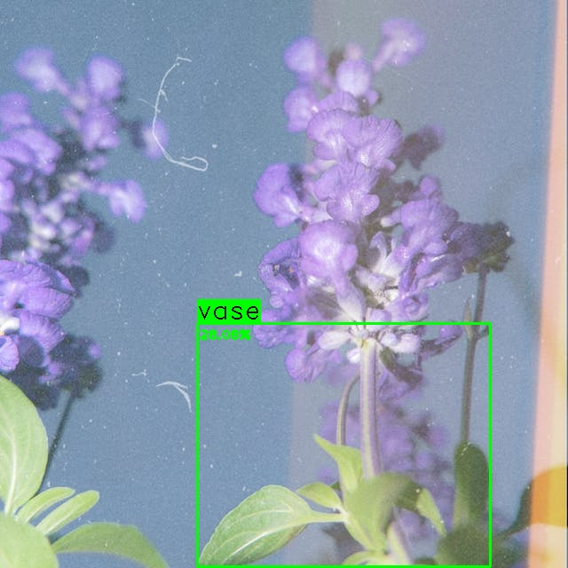

# Rovereye

A first attempt at a custom YOLOv8.

It's Rust because I can't stand troubleshooting Python exceptions. We'll convert it later (unless...? 😳)

</img>

## Setup

First, you'll need Rust. Follow the instructions [on this site](https://rustup.rs/) - it'll only take a minute or so to get everything running!

Afterward, go ahead and clone the repo. You can now download the model we'll be using. Stick it in the `pretrained/` folder.

Now, let's focus on platform-specific setup for OpenCV and YOLO...

### Linux

Please consider using Linux if possible - macOS has a lot of trouble linking, both with static and dynamic linking. On the other hand, Windows isn't widely supported in terms of acceleration or even general usage.

A VM will suffice if you don't mind some waiting. 😄

Anyway, run one of these commands on your machine according to its distribution:

- Debian/Ubuntu/etc.: `sudo apt update && sudo apt upgrade -y && sudo apt install -y build-essential cmake opencv-contrib libopencv-contrib-dev libgtk2.0-dev pkg-config libboost-all-dev ffmpeg libonnx-dev libonnx1 python3`
- Fedora/RHEL/etc.: `sudo dnf update -y && sudo dnf groupinstall "Development Tools" -y && sudo dnf install -y clang-devel libxcrypt-compat gcc cmake python3-devel llvm-devel opencv-contrib opencv-devel boost-devel ffmpeg onnxruntime onnx-devel onnxruntime-devel python3 protobuf-devel`
- Others: grab C/C++ development tools, `boost`, OpenCV, `protobuf`, Onnx Runtime, `ffmpeg`, and a relatively modern version of Python (~3.10)

### macOS

You'll likely need to manipulate your environment variables to include a modern Clang++ version from `brew`. As such, your linker will get mad, and you'll have to fix it, too. Please try to use Linux if possible.

- If Linux isn't feasible: `brew install onnxruntime ffmpeg python3 gtk4 gdk-pixbuf protobuf`

#### Compiling OpenCV with Protobuf

If you get an error complaining about OpenCV not having `protobuf` support compiled in, then you're using the Homebrew version.

You need to compile it yourself. Here are some instructions...

1. Head to a place you don't care about and `git clone https://github.com/opencv/opencv`
1. You'll also want to grab the `opencv_contrib` set of modules: `git clone https://github.com/opencv/opencv_contrib`
1. `cd opencv`
1. `mkdir build`
1. `cd build`
1. Run this giant command: `cmake -DCMAKE_CXX_STANDARD=11 -DCMAKE_OSX_DEPLOYMENT_TARGET= -DBUILD_JASPER=OFF -DBUILD_JPEG=OFF -DBUILD_OPENEXR=OFF -DBUILD_OPENJPEG=OFF -DBUILD_PERF_TESTS=OFF -DBUILD_PNG=OFF -DBUILD_PROTOBUF=ON -DBUILD_TBB=OFF -DBUILD_TESTS=OFF -DBUILD_TIFF=OFF -DBUILD_WEBP=OFF -DBUILD_ZLIB=OFF -DBUILD_opencv_hdf=OFF -DBUILD_opencv_java=OFF -DBUILD_opencv_text=ON -DOPENCV_ENABLE_NONFREE=ON -DOPENCV_EXTRA_MODULES_PATH="../../opencv_contrib/modules" -DOPENCV_GENERATE_PKGCONFIG=ON -DPROTOBUF_UPDATE_FILES=ON -DWITH_1394=OFF -DWITH_CUDA=OFF -DWITH_EIGEN=ON -DWITH_FFMPEG=ON -DWITH_GPHOTO2=OFF -DWITH_GSTREAMER=OFF -DWITH_JASPER=OFF -DWITH_OPENEXR=ON -DWITH_OPENGL=OFF -DWITH_OPENVINO=ON-DWITH_QT=OFF -DWITH_TBB=ON-DWITH_VTK=ON -DBUILD_opencv_python2=OFF -DBUILD_opencv_python3=ON -DPYTHON3_EXECUTABLE="/opt/homebrew/bin/python3" -DCMAKE_BUILD_TYPE=Release ../`
1. Start compiling with `make -j7`.
1. Install it to your system with `make -j7 install`.
1. Run `opencv_version` and make sure it says `4.(something)-dev` in response!

### Windows

TODO???

There are numerous compatibility issues, so I suggest running a VM through VirtualBox or WSL.

### Model

When you download a model to train from, make sure you convert it to ONNX using [the incredible script](https://crates.io/crates/od_opencv#user-content-prerequisites) that the Rust guy made.

Create a virtual environment and download the dependencies (`ultralytics` `onnx`). Then, you can convert it correctly!

For additional instructions, see [training/README.md](training/README.md).
